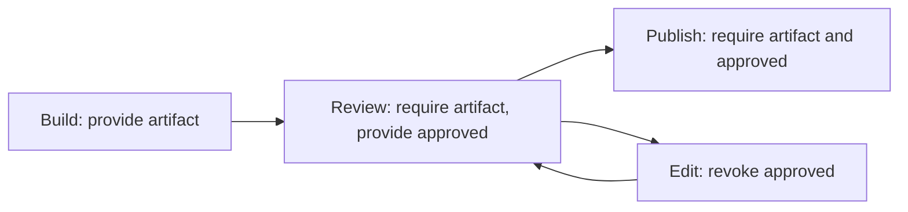

# CFG evaluation history: workflow preflight and dependency impact

The shared concept is to check a process's prerequisites and the potential impact
of a change before running it. The consumers now live in
[`src/graph-analysis`](../src/graph-analysis). They use only the explicit CFG facade
(`src/cfg/index.ts`, the source of `@mizchi/uneffect/cfg`) and their own domain
contracts. No changes to the public CFG API were needed.

The initial measurements below were recorded on 2026-09-06. On 2026-09-07 the
consumers graduated to supported `/workflow` and `/impact` APIs, with strict
parsers, discriminated diagnostics and a separate transition limit. The current
contract and qualification criteria are in [graph analysis](./graph-analysis.md);
this page retains the initial applicability evidence. Evaluation adapters and
reference algorithms now live under `bench/graph-analysis`.

## Run and inspect

From the repository root with Node 24+ and dependencies installed:

```sh
just graph-check
just graph-evaluate > /tmp/uneffect-cfg-evaluation.json
```

The evaluation prints JSON containing workflow diagnostics, affected nodes and
their change origins, reference comparisons, coverage boundaries, and local
timings. Any reference mismatch or unexpected scenario verdict exits nonzero.
Timings are observations, not pass thresholds or a reproducible performance benchmark.

- `contracts.ts`: supported input/result contracts exported through the public facades.
- `impact.ts`: `analyzeImpact(nodes, changed, options?)`.
- `workflow.ts`: `verifyWorkflow(workflow, options?)`.
- `parallel-model.ts`, `parallel-transitions.ts`, `parallel-workflow.ts`: parallel
  configuration contracts, pure atomic transitions, bounded exploration and
  reverse CFG analysis of barrier reachability.
- `scenarios.ts`: editable release workflow and build graph examples.
- `import-graph.ts`: optional TypeScript parser adapter for repository evaluation.
- `oracles.ts`: independent traversal and exhaustive concrete execution baselines.
- `parallel-oracle.ts`: independent lane-preserving schedule enumeration.
- `evaluate.ts`: the report runner; reads `src/`, never executes workflow steps.

The two analyzers typecheck against ECMAScript alone, with no Node, DOM, compiler,
or solver ambient types. Only the repository adapter and evaluation runner need
Node/the existing TypeScript parser. The supported package entrypoints are `/workflow` and `/impact`; the evaluation
runner remains repository tooling and adds no Uneffect CLI command.

## Dependency impact: possible change origins

Input dependencies point from a consumer to its inputs. The adapter reverses
those edges and propagates sets of changed node IDs. At a merge it takes the
union. A synthetic entry supports multiple changes without mixing their origins.

The result includes changed nodes, affected consumers with their individual
causes, and unaffected nodes. Cycles converge because the finite origin sets
only grow. This is potential impact within the supplied graph, not evidence that
an output actually changed or that rebuilding in any particular order is valid.

The eight-node build scenario changes `api-schema` and `theme`:

| Consumer | Causes |
| --- | --- |
| `generated-client` | `api-schema` |
| `web-bundle`, `web-tests` | `api-schema`, `theme` |
| `worker-bundle`, `worker-tests` | `api-schema` |
| `docs` | None |

Together with the two changed inputs, seven nodes are affected and one is
unaffected. This provides both a candidate rebuild/test set and an explanation
of which input changes caused inclusion. It does not yet provide an edge-by-edge
witness path.

## Workflow preflight: prerequisites guaranteed on every path

An action step declares `requires`, `provides`, `revokes`, and alternative `next` steps.
Requirements are checked at step entry. Its transfer removes revoked facts and
then adds provided facts. All declared outgoing transitions are possible; facts
provided by a step are assumed to hold on every outgoing transition. Missing
requirements are diagnostics, not guards that suppress a path. Failures must be
represented as explicit alternative steps/transitions with appropriate facts.

At a merge, guaranteed facts are intersected. Unreachable is represented by
`null`, separately from a reachable empty set. This distinction both initializes
the intersection domain correctly and ensures no-op steps propagate reachability.
Diagnostics are extracted after convergence, because a later incoming path or
loop revisit can invalidate an earlier guarantee.

The release example is:



| Mutation | Expected and observed result |
| --- | --- |
| Original graph, editing returns through review | Valid |
| Add a direct build-to-publish route | Publish is missing `approved` |
| Send edit directly to publish | Publish is missing `approved` |
| Put build and review on alternative branches before publish | Publish is missing both guarantees |

The last case is deliberately an alternative-branch model. A parallel fork with
an AND barrier has different semantics and must use the explicit kinds below.
Also covered: requirements cannot be satisfied by a step's own output, zero-trip
loops cannot establish a prerequisite, and unreachable steps are reported
separately without reporting their requirements as reachable violations.

`valid` only means prerequisites hold at all reachable steps in this declared
model. It does not establish termination, eventual publication, runtime success,
the truth of declared approvals, or the correctness of workflow extraction.
This domain has Boolean facts and unconditional add/remove transfers; it does
not model branch guards, correlated values or resource capacities.

## Explicit parallel forks and AND barriers

`kind: "fork"` starts every branch in `next` and names its matching `join`.
`kind: "join"` names its owning `fork` and waits for one arrival from every
branch of that activation. Action and join successors remain alternatives.
An omitted `kind` continues to mean an ordinary action, preserving existing models.

```ts
const workflow: Workflow = {
  entry: "prepare",
  steps: [
    { id: "prepare", kind: "fork", join: "ready", next: ["build", "review"] },
    { id: "build", provides: ["artifact"], next: ["ready"] },
    { id: "review", provides: ["approved"], next: ["ready"] },
    { id: "ready", kind: "join", fork: "prepare",
      requires: ["artifact", "approved"], next: ["publish"] },
    { id: "publish", requires: ["artifact", "approved"], next: [] },
  ],
};
verifyWorkflow(workflow); // valid
```

Each step is an atomic operation on shared Boolean facts. The parallel analyzer
explores every enabled step ordering, keeping facts and control tokens together
in a configuration. It does not union branch snapshots: if a sibling revokes
`approved`, an old snapshot cannot restore it. Requirements on a sibling's output
before the join can fail when that sibling has not run yet. Join requirements and
effects execute only when all arrivals are present, then its continuation runs
once. Missing prerequisites still report violations rather than disabling steps.

Nested forks retain the parent branch identity. A join consumes every arrival
and removes its activation before resuming the parent, so repeated completed
forks cannot reuse earlier arrival tokens. One live activation per static fork ID
is supported. Reentering that fork while it is still active, crossing to another
scope's join, or an invalid fork/join pairing returns `unknown` with an input
error; no partial verdict is exposed.

Ending a branch without its matching join leaves that activation pending. After
bounded configuration discovery, the existing CFG solver propagates reachable
join identities backwards over the configuration graph. Any reachable active
fork with no remaining path to its own join is reported as `blocked-join`. This
catches both dead ends and closed loops, including failure alternatives when
another alternative could have succeeded. It also avoids blaming an earlier,
working barrier for a later blocked barrier.

```json
{
  "kind": "blocked-join",
  "step": "ready",
  "fork": "prepare",
  "waitingFor": ["review"]
}
```

There is one representative blocked configuration per fork, preferring the one
with the most arrivals and breaking ties lexically. `waitingFor` describes that
configuration; it is not the union of missing branches across unrelated paths.
Parallel `guaranteed`/`unreachable` refer to enabled step execution: a join that
has waiting tokens but can never fire is listed as unreachable.

The parallel verdict checks prerequisite safety and whether every active barrier
can still be reached from every reachable configuration. It is **not a liveness
proof**: a retry loop with an exit can remain `valid` even if a scheduler could
retry forever. There are no fairness, timeout, cancellation or atomicity-below-a-step
assumptions hidden in a successful verdict. Progress guarantees would require a
separate contract and analysis.

Sequential-only models retain the original compact must-analysis. Models with
fork/join steps use explicit configurations because facts and arrivals from
different alternatives/activations cannot safely be merged independently.
`maxConfigurations` defaults to 10,000; exceeding it returns
`unknown` / `state-space-exhausted`. The work `budget` defaults to 100,000 and
counts configuration expansions plus processed blocks in reverse CFG propagation.
Both limits must be positive safe integers. State growth is exponential in
parallelism and Boolean facts; this is a bounded preflight prototype.

## Evaluation recorded on 2026-09-06

The implementation followed contract/test-first development. Focused tests cover
negative controls, their repairs, cycles, disconnected nodes, empty changes,
invalid inputs and budgets. Additional comparisons use:

- 128 deterministic generated dependency graphs, compared with one independent
  ordinary traversal per changed input.
- 128 deterministic generated five-step, three-fact workflows, compared with
  exhaustive execution of concrete `(step, facts)` configurations. The corpus
  visits 544 configurations, including loop revisits; there is no path-length
  cutoff. All verdicts, missing facts, guaranteed facts and unreachable nodes
  match. The test also reverses step/edge order to vary scheduling.
- 128 generated parallel models with two or three lanes, compared with all
  2,752 lane-preserving schedules. Verdicts, prerequisite diagnostics and guaranteed
  facts match. The reference enumerates permutations without sharing the production
  token/activation model, transition function or CFG graph. Reversed input order
  produces the same results. Dedicated tests cover nested and repeated forks,
  abandoned branches, closed loops, competing grants/revocations, invalid scopes,
  and both resource limits.
- A 2,000-node, 3,982-edge synthetic build graph with two changes: all 2,000
  nodes affected, 3,001 processed blocks, matching the independent traversal.
- This repository's 137 source files and 613 distinct literal relative import
  dependencies, including type imports and reexports.

| Changed source | Potentially affected files, including itself | Unaffected files |
| --- | ---: | ---: |
| `src/cfg/contracts.ts` | 82 | 55 |
| `src/cfg/completion.ts` | 86 | 51 |
| `src/runtime/numeric.ts` | 4 | 133 |

The numerical utility reaches only itself and three API facades. Changes to the
CFG contracts reach multiple analyzers and CLI entrypoints. This demonstrates
useful distinctions in potential impact; it does not measure real rebuild or CI
time savings.

For the recorded synthetic graph, the CFG consumer took about 5.4 ms and the
independent traversal about 1.0 ms. Repository solves took about 0.2–0.3 ms,
excluding parsing. These are single local samples: the implementation is small
enough for the tested interactive use, but there is no evidence of a speed
advantage over simple traversal.

The runnable parallel examples also pass: a build/review AND barrier is valid;
a review branch that ends early reports `blocked-join`; concurrently revoking
approval reports the missing prerequisite; a retry with an available path to the
barrier remains valid under the non-liveness contract. The initial local runs
took under 1 ms each; these small samples do not establish a scaling guarantee.

The repository adapter covers literal ESM imports, reexports and import types in
the supplied source snapshot. There were no unresolved imports in that scope.
External package imports are listed separately. CommonJS loading, filesystem
reads, generated inputs, package resolution, build configuration and tsconfig
aliases are outside scope. Computed imports and unresolved relative imports are
reported explicitly. Therefore the report must not be used on its own to decide
which real CI checks can safely be skipped. Deleted inputs would also require
the old graph or a union of old and new dependency edges.

## Assessment and next direction

**Workflow preflight is the stronger next application.** It catches concrete
ordering mistakes that reachability alone cannot detect, while the current
finite fact domain stays small and produces understandable diagnostics. A useful
next step is an adapter for one actual workflow format using the now-explicit
distinction between alternative transitions and parallel dependency barriers.
Add a violating execution trace to diagnostics when making this an end-user tool.

**Impact analysis is useful as a companion and a baseline.** For a plain affected
set, ordinary traversal is simpler and was faster in the local samples. The CFG
consumer's value is reuse of the same domain/propagation contracts, provenance
sets, and explicit incomplete-result handling. Validate a real build-system
graph adapter before claiming rebuild avoidance or adding incremental caching.

Both consumers work with the existing CFG contract. Keep their lattices and
domain postconditions outside the core; there is no demonstrated need yet for a
new graph framework, public workflow DSL, or CFG API expansion.

Both discard partial results on budget exhaustion or malformed graphs and return
`unknown`, without an affected plan or a valid/invalid workflow verdict. Budgets
count processed blocks rather than milliseconds. As with the underlying API,
non-positive/non-integer budgets throw instead of being domain analysis results.
